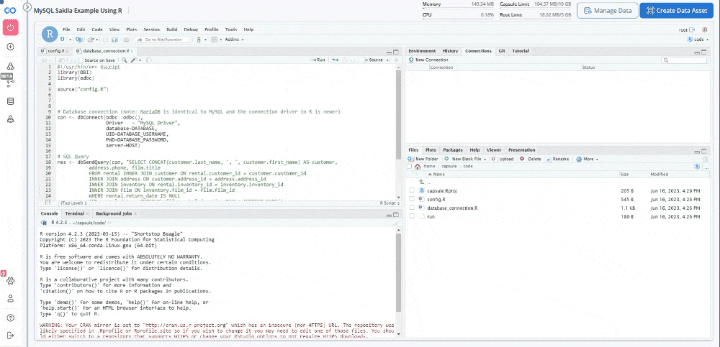

# MySQL Sakila Example Using R

This capsule is intended to show an example reproducible run that queries the example [Sakila](https://dev.mysql.com/doc/sakila/en/) database. The Sakila sample database is designed to represent a DVD rental store.

## Set up credentials

In order to run this capsule, you will need to add your database credentials to the environment. See the [secrets management](https://docs.codeocean.com/user-guide/v/v2.12.0/secret-management-guide) guide for more information.

## App Panel Parameters

Hostname
- This is the hostname of the server which serves the MySQL database. Note: This server must TCP allow access from the Code Ocean VPC over the 3306 port. [default: jsnedecor-mysql.cm7kuqeedvj0.us-east-1.rds.amazonaws.com]

Database
- Database name to connect to. [default: sakila]


# MySQL connections pane

In order to interactively work with MySQL, launch a RStudio cloud workstation. 

First we need to connect to the MySQL database in the connections pane. In order to do this, execute the following lines from the database_connection.R file: 

```r
#!/usr/bin/env Rscript
library(DBI)
library(odbc)

source("config.R")


# Database connection (note: MariaDB is identical to MySQL and the connection driver in R is newer)
con <- dbConnect(odbc::odbc(),
                 Driver   = "MySQL Driver",
                 database=DATABASE,
                 UID=DATABASE_USERNAME,
                 PWD=DATABASE_PASSWORD, 
                 server=HOST)
```


Make sure that the database and server are correctly set in the config.R file since we are using an interactive workstation. 



If we want to preview the content in a table, we can click on the preview button next to each table in the database


Now, we want to open a sql file in order to execute queries. First click on the "SQL" button in order to open a new sql file. Save it to the code directory. 


If we want to see the output of running a query, we can click the "preview" button in order to see the output. 


For more information, please refer to the RStudio documentation. 
